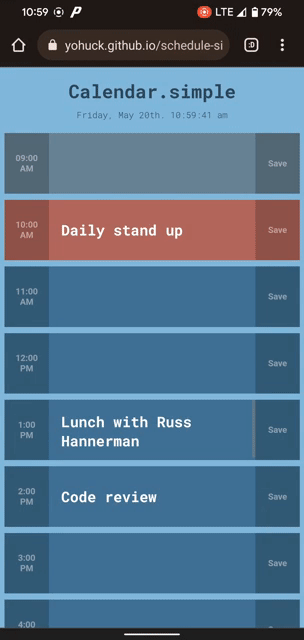

# DU Bootcamp Challenge #5 - Day Calendar

Link to live project: https://yohuck.github.io/schedule-simple/

For this project, I used HTML, CSS, JS, and third party/browser APIs to create a day calendar that allows users to input tasks, save them, and visually see their day ahead. I used local storage to ensure the tasks persist for the user.

## User Story
            AS AN employee with a busy schedule
            I WANT to add important events to a daily planner
            SO THAT I can manage my time effectively
## Acceptance Criteria
            GIVEN I am using a daily planner to create a schedule
            WHEN I open the planner
            THEN the current day is displayed at the top of the calendar
            WHEN I scroll down
            THEN I am presented with timeblocks for standard business hours
            WHEN I view the timeblocks for that day
            THEN each timeblock is color coded to indicate whether it is in the past, present, or future
            WHEN I click into a timeblock
            THEN I can enter an event
            WHEN I click the save button for that timeblock
            THEN the text for that event is saved in local storage
            WHEN I refresh the page
            THEN the saved events persist

## Screenshot

